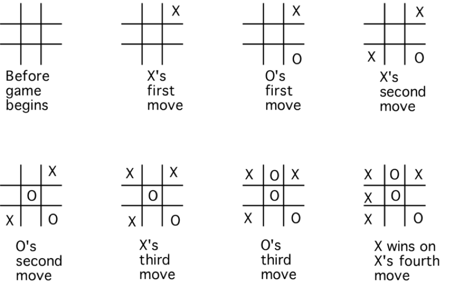

# Tic-Tac-Toe Game with Tree-based Win Detection

This project is a console-based Tic-Tac-Toe game where two players take turns selecting cells in a 3x3 grid. The winner detection is implemented using a tree-based approach, which ensures efficient and clear checking of win conditions across the board. While this method works, it is primarily a **fun experiment**, and there are definitely more optimized ways to solve this problem in real-world scenarios.

---

## Table of Contents

- [Introduction](#introduction)
- [Setup & Run](#setup--run)
- [How to Play](#how-to-play)
- [Winning Conditions](#winning-conditions)
- [Game Models](#game-models)
- [How it Works](#how-it-works)
- [Conclusion](#conclusion)

---

## Introduction

This project implements a Tic-Tac-Toe game where two players (P1 and P2) take turns to select cells in a 3x3 grid. A winner is determined if one player occupies a row, column, or diagonal completely. This implementation uses a **tree-based approach** to traverse and evaluate winning conditions.

This is a **fun experiment** to explore different ways of implementing Tic-Tac-Toe. While this method works, there are definitely more optimized ways to solve the problem.

---

## Setup & Run

1. Clone the repository:
   ```bash
   git clone https://github.com/saeedkhorsand/TicTacToe.git
   ```

2. Open the project in Visual Studio or your preferred IDE.

3. Restore dependencies:
   ```bash
   dotnet restore
   ```

4. Build the project:
   ```bash
   dotnet build
   ```

5. Run the project:
   ```bash
   dotnet run
   ```

---

## How to Play

1. The game starts with an empty 3x3 grid. Two players (P1 and P2) take turns selecting a position in the grid.
2. Players cannot select a cell that has already been selected, whether by themselves or the opponent.
3. The game ends when one player wins or the grid is full (resulting in a draw).

### Input Format

The grid positions are specified by their coordinates, with `(0, 0)` being the top-left corner. Enter the row and column numbers when prompted.

For example:
```
Enter row: 1
Enter column: 2
```

---

### Game Visual

Below is an example of the game in progress:



---

## Winning Conditions

A player wins if they occupy:
1. **A full row** (horizontal win).
2. **A full column** (vertical win).
3. **A full diagonal** (either from top-left to bottom-right or from top-right to bottom-left).

Here is a visual example of possible winning conditions:

- **Horizontal:**
  
  ```
  X | X | X
  - | - | -
  - | - | -
  ```

- **Vertical:**
  
  ```
  X | - | -
  X | - | -
  X | - | -
  ```

- **Diagonal:**
  
  ```
  X | - | -
  - | X | -
  - | - | X
  ```

- **Reverse Diagonal:**

  ```
  - | - | X
  - | X | -
  X | - | -
  ```

---

## Game Models

The game consists of the following key models:

1. **Player**: Represents each player with a name.
2. **Col (Column)**: Represents each cell in the Tic-Tac-Toe grid, containing its `(x, y)` coordinates and which player selected it.
3. **Game**: Contains the core logic for setting up the grid, allowing players to select cells, and checking for winners.
4. **GameTree**: Converts the grid (a matrix) into a tree structure, allowing efficient traversal to detect win conditions in all directions (horizontal, vertical, diagonals).

---

## How it Works

### Tree-based Win Detection

After each move, the state of the grid is converted into a **tree structure**. The tree allows the game to efficiently check if a player has achieved a winning condition in any of the following directions:

- **Right** (for horizontal wins),
- **Down** (for vertical wins),
- **Right-Down Diagonal** (for regular diagonal wins),
- **Left-Down Diagonal** (for reverse diagonal wins).

Each node in the tree represents a move made by a player, and the tree structure is built as the game progresses. The tree is then traversed to check if there is a continuous path of moves made by the same player.

---

## Conclusion

This project showcases a fun and experimental way of detecting winners in Tic-Tac-Toe using tree-based traversal. There are certainly more optimized methods for solving this problem, but this approach provides a unique perspective on how the game state can be represented and processed.

Feel free to explore the code and experiment with different strategies for winner detection!
